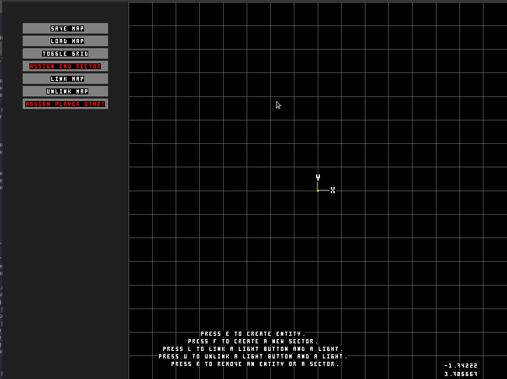
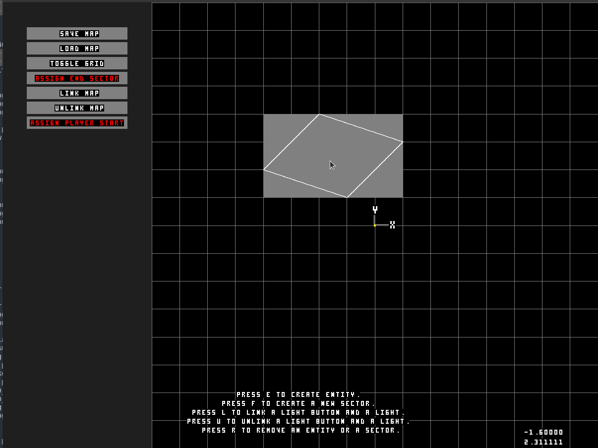
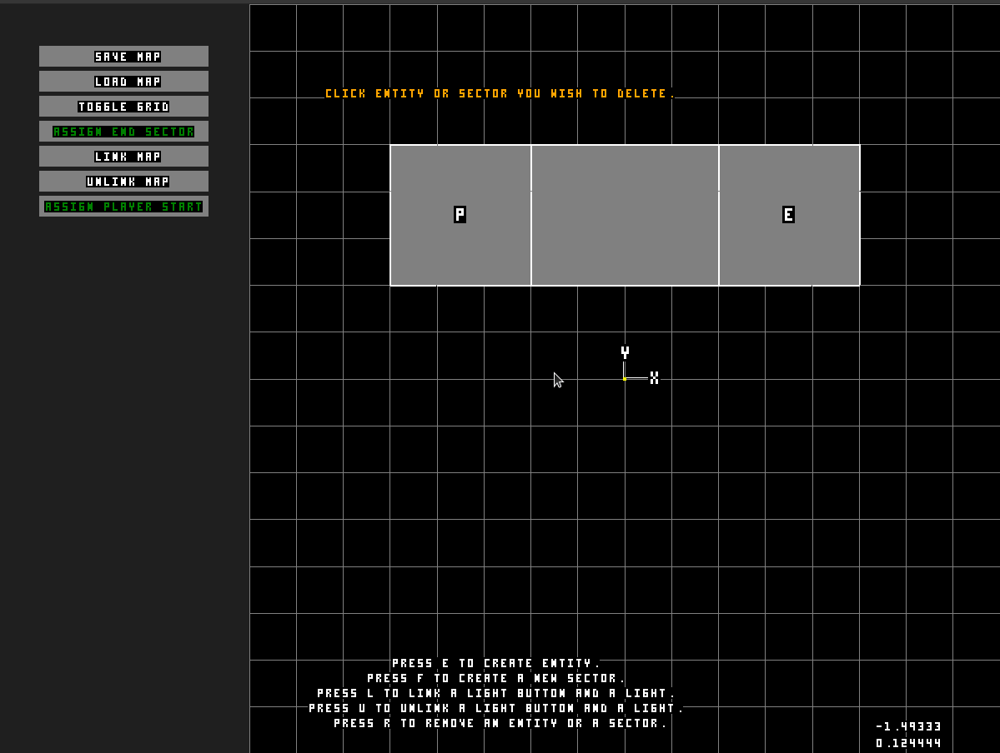
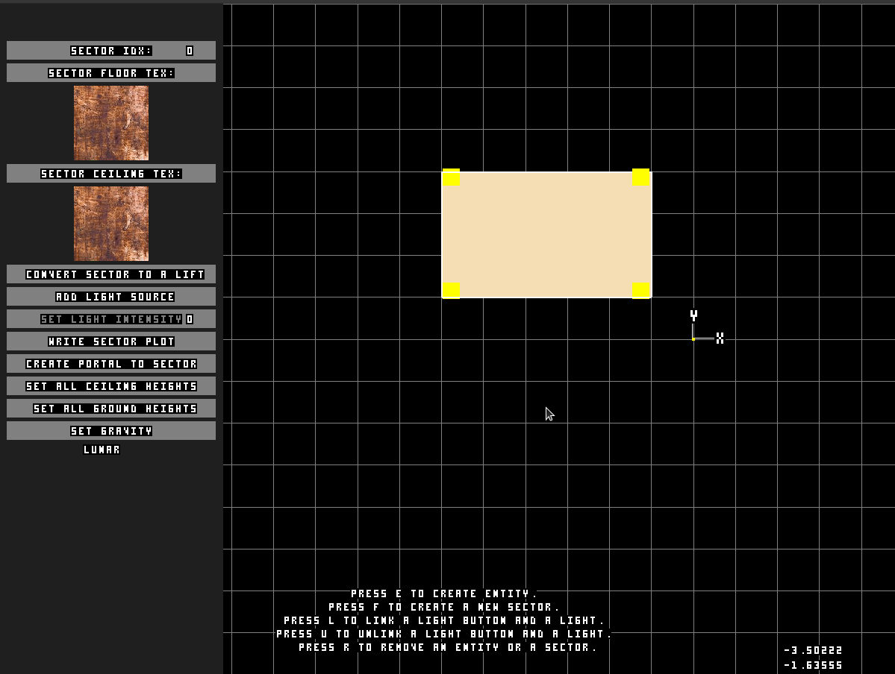
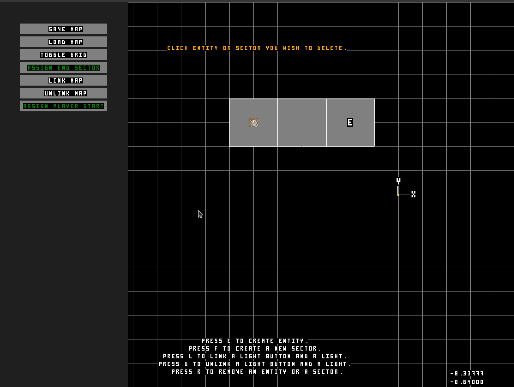
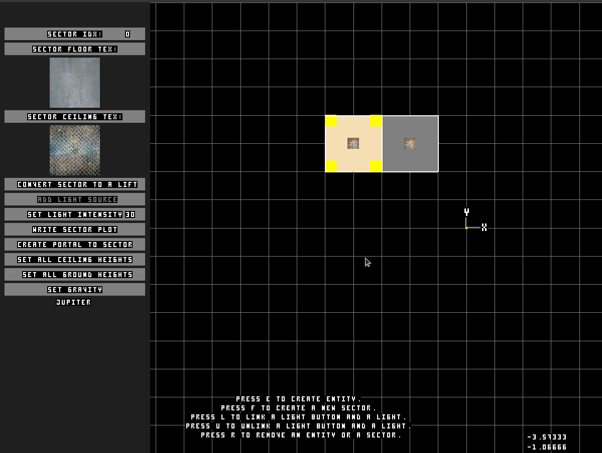
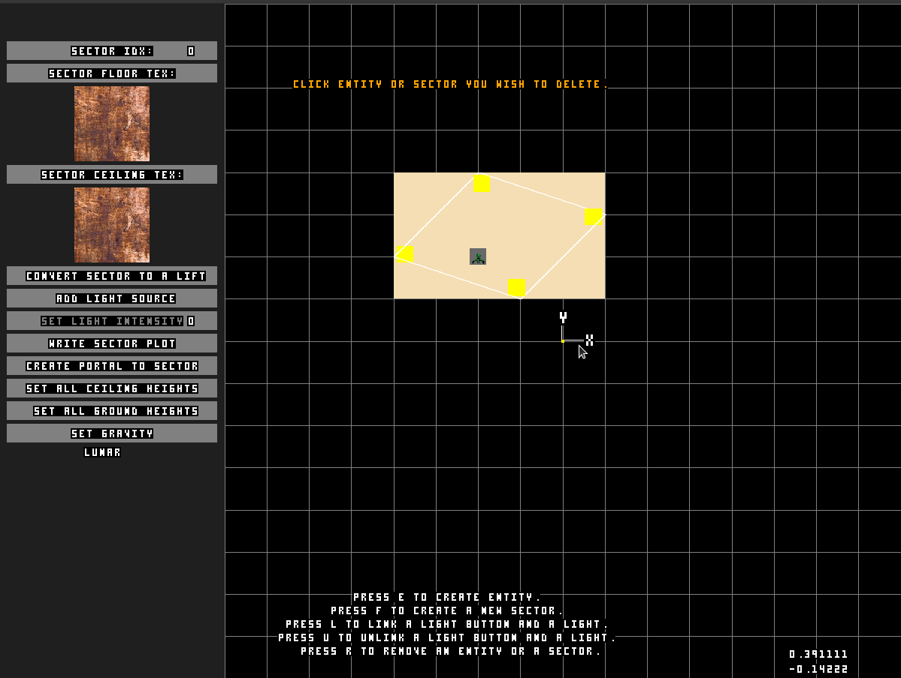
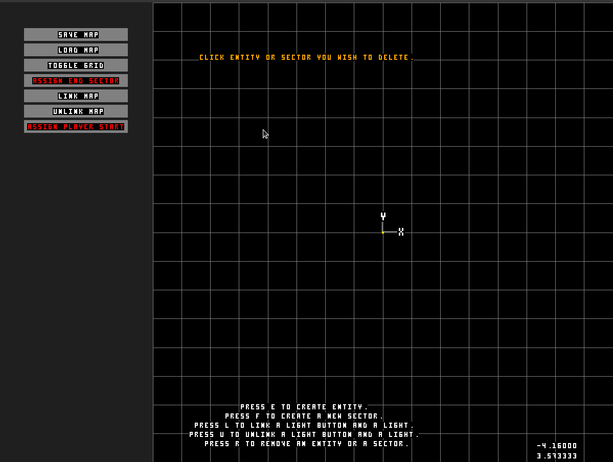

# Doom-Nukem
Final Project in the graphics branch of Hive Helsinki code school. Idea of the projects is to extend wolf3d project, and make it a full blown game, with animations, collisions, sprites, sounds, music and a map editor.

## Final score
 

## In-game video

Click the picture to see video about the game in youtube!

## Usage
- In Windows environment, you have to install MingW gcc compiler for Windows.
Download the installer from https://sourceforge.net/projects/mingw/files/Installer/
This project assumes that it is installed to C:\MinGW
- In Linux environment you will need `gcc` compiler to be installed.

	sudo apt-get update
	sudo apt-get install build-essential

- Run `make` in the root of the project to compile the program.
- Run maps by piping them to program. ie.
	`./doom-nukem map_files/test.DN2`

## Design Reasonings
We decided to pursue a track of creating Duke Nukem-like engine, and to expand the one that I have in project `wolf3d`. Eventually we switched from Build engine to complete 3D engine using matrices and meshes. The whole engine is running reverse, which causes objects to have no depth. Render list is handled in 2d. Possible visible sectors are added to a sector buffer, and that is passed to the renderer.

## Biggest blocks throughout project
- Making linked list to cycle list due to traversing walls in a sector.
- Precision of a float.
- Calculating correct pixel offset (integers) with angles (float).
- Segfault in renderer when the recursive function returns back to the same portal it came from.
- Wall distorted because only angle is used. Solved using perpentual distance to the wall, and scaling it to the view.
- Getting correct offset for wall textures.
- Correcting walls by perspective-correct interpolation from affine texture coordinates.
- Correcting floors by perspective-correct interpolation.
- Trying to get all the functions to work with Windows as well as they do in Linux environment.
- Moving away from Build Engine type of structure to full 3D engine.
- Typecasting to from (float) to (int) when drawing scanlines.
- Implementing polygon clipping.
- Floating point issues with arccos functions.
- Getting collisions work when more complexity is added to the engine day by day.

## Learned through project
- Makefile and Makefile rules
- Batch scripting
- How to deploy code to a seperate repository
- Git Actions (Norminette and build script)
- Platform specific design problems (__write vs. write)
- Raycasting technique.
- Build engine internals.
- Convex space and polygons.
- Vector mathematics.
- Sector based map design.
- Affine texture mapping.
- Perspective correct texture mapping.
- Matrix calculations.
- Triangulation algorithms.
- Sutherland-Hodgeman Polygon Clipping.
- From flat shading to Gouraud shading.
- Averaging unit vectors and adjacent triangles.
- Using lighting models Phong-Blinn vs. Lambertian reflectance.
- Subdivision of scanlines to smaller batches to improve calculation speed ie. Quake and demos used these in end of 1990s
- Manipulation of direction and velocity of entities based on time.
- Manipulation of direction of the sprites to create animations and perspective to an object.
- Where void pointers and pointers to functions should be used.
- Möller–Trumbore ray-triangle intersection algorithm
- Game design.
- Level design.

## Project duration and work distribution
- Most of the game engine, collision logic, raycasting, raytracing, light, texturemapping, textures and parts of the level editor was written by me.
- Riku Zukale focused on PNG parser and porting, writing level data, writing out music and audio data and level editor. [rzukale](https://github.com/rzukale)
- Tomi Määrelä [HandsomeTom](https://github.com/handsomeTom/) wrote parts of the original engine, utility functions, drew the hud and did level testing.
- Elias Parviainen [(Pan1cs)](https://github.com/pan1cs) produced and recorded audio and music for the game, and did parts of the level editor.

## Editor features

Use F key to create new sectors and draw them to the grid.

Use E key to create placable entities on the map, like keycards and enemies.

Create lifts by first editing height of the lift when going up, and height of the floor when going down. You'll need at least five sectors to properly handle a lift.

Create portals to other sectors by drawing a line to the sector you want the portal to face. You can cycle then through different portal options from doors to windows.

Edit entities by clicking on their bounding box. Cycle between different options and toggle textures and states.

Edit sectors by clicking on them. You can change lighting, intensity of the light, and whether it's manual or not.

Edit walls by clicking on corners of the sector. You can change lighting, intensity of the light, and whether it's manual or not. You can add features on walls by buttons.

Use R key to remove undesired sectors and left click on them.

Save your creation with save button. You'll need at least a player start and end sector.

## Walkthrough of the engine
Game engine is split to parts, parsing, porting and game loop. Most of the data in the level file is parsed together by the other functions. Level data has following values:

	#doom_nukem_sectors#3#2#0
	#-3#3#0
	#sector0#4#-12#-12#0#2
	#-5#2#-2#0#3
	#-5#5#-2#0#3
	#-2#5#-2#0#3
	#-2#2#-2#0#3
	#-1#-1#0#0#0
	#0

Row | Explanation
----|------------
#doom_nukem_sectors#3#2#0|idx to find level data, followed by number of sectors in the file, sector where level ends and boolean whether map is linked to another map to form a campaign, followed by a mapname.
#-3#3#0|x and z coordinates of the player, followed by the starting sector.
#sector0#4#-12#-12#0#2|sector, idx of the sector, number of walls, texture idx of ground and ceiling, is sector part of a lift and level of gravity.
#-5#2#-2#0#3|x, z, idx of the texture/link to another sector, height of the floor and height of the ceiling.
#-1#-1#0#0#0|x, z of the light, intensity of the light, control of the light and state of light.

Sector data is parsed together to create a set of triangles, where a wall is just two triangles, top half and bottom half. `calc_map_properties` triangulates the level data to create floors, and ceilings based on the 2d polygon of the sector, taking account height of the ceiling and height of the floor at each point. At this point extra walls are calculated to fill out gaps between sectors. If another sector's floor is higher than another, then the empty room is filled with a wall.
Also doors are created to the sectors that have a index ranging from 3000 - 18000. Lift doors are created after this. Each lift has two doors, one for each floor. For simplicity's sake, other one remains locked, while other is used. After this all planes are calculated (`calc_unit_normals`), and button locations are calculated from their integer values from the map data. `calc_entity_locations` is made to ensure entities are not outside their given sectors. `calc_plr_position` calculates current position of the player based on x and z values, and finally placed on the right height `player_place_feet_to_ground`. `assign_entity_properties` calculates normals based on the orientation of the entity, whether it is on the wall, whether it is moving, what textures it has and so forth. Same is done with projectile pool.

After all this is calculated, and all other necessary stuff has been allocated in the memory, music parsed from map data and written to temp folder, then we can launch the game loop.

## Links
- Fabien's Sanglard's tutorial for Building Duke Nukem Graphics Engine [Link](https://fabiensanglard.net/duke3d/build_engine_internals.php)
- Perspective Texture Mapping and scanline division by Mikael Kalms [Link](https://www.lysator.liu.se/~mikaelk/doc/perspectivetexture/)
- Perspective Texture Mapping article series by Chris Hecker [Link] http://www.chrishecker.com/Miscellaneous_Technical_Articles
- Floor and Ceiling Drawing tutorial by Lodev. Idea of continuing drawing after the wall has been drawn stems from here! [Link](https://lodev.org/cgtutor/raycasting2.html)
- CS184 Lecture 30 summary [Link](https://people.eecs.berkeley.edu/~jfc/cs184f98/lec30/lec30.html)

## Credits
- Crewmember sprite credits go to [NMN](https://opengameart.org/users/nmn)
- Music and most of the audio was produced and recorded by Elias Parviainen [(Pan1cs)](https://github.com/pan1cs)
